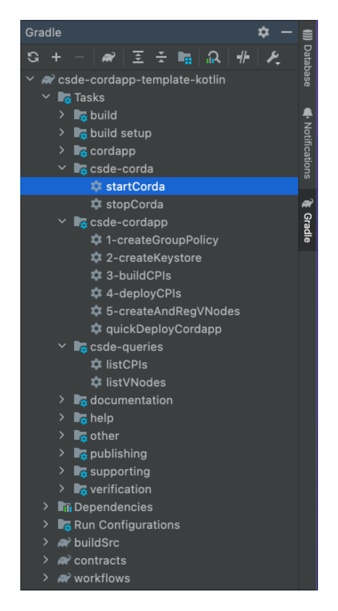
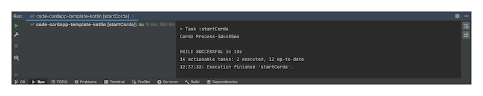
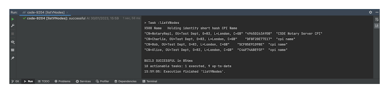
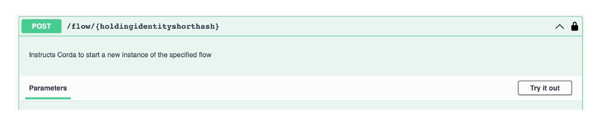

# IOU CorDapp

This CorDapp is the complete implementation of the signature IOU (I-owe-you) demonstration.

Note: This sample was created using the Next-Gen Corda [CorDapp Standard Development Environment (CSDE) Java Template](https://github.com/corda/CSDE-cordapp-template-java)

### States
`IOUState`: The IOUState represents an IOU that can be issued, settled, and transferred by a borrower to the lender.

### Contracts
`IOUContract`: This is used to govern the evolution of an `IOUState`. This file includes validation rules governing the `Issue`, `Settle`, and `Transfer` command for IOUState.

### Flows
`IssueIOUFlow`: This flow allows the borrower to create a new IOU state between the borrower and the lender on the ledger.

`SettleIOUFlow`: This flow allows the borrower to pay back the lender a specified amount.

`TransferIOUFlow`: This flow allows the lender to transfer an existing IOUState to a new lender.

`ListIOUFlow`: This flow lists out all the unconsumed IOUStates.


## Prerequisites
[Please ensure that your device is set up for CSDE.](https://docs.r3.com/en/platform/corda/5.0-beta/developing/getting-started/prerequisites/prerequisites.html)

## Start the combined Corda workers
1. Click on `startCorda` on the right-hand-side Gradle panel (under `csde-corda`)


2. The startCorda task should complete relatively quickly with this message:


3. Wait approximately for one minute for Corda to finish its start-up routine. You can use the `listVNodes` helper to check the liveness of the combined CSDE worker.
4. Corda exposes HTTP REST API endpoints for interacting with itself and the CorDapps running on it. It also exposes a Swagger interface which is described in the following sections.
   <br>To display the Swagger UI, use the following link:
   https://localhost:8888/api/v1/swagger#/

5. Click on `quickDeployCordapp` to deploy the CorDapp. <br>Upon successful deployment of the CPI, the GET /cpi function call should now return the metadata of the CPI we just uploaded.
6. If you click on `listVNodes` again, it should now also display a list of the configured virtual nodes:

The 12 digit hash is the `holdingidentityshorthash` that acts as the unique identifier for a virtual node.


## Run the IOU CorDapp

**1. Issue IOU**
<br>Let's create an IOUState (Alice will borrow 10 from Bob).
<br>Expand the `POST /flow/{holdingidentityshorthash}` endpoint in the Flow Management API section in Swagger. 

Enter the Alice's `holdingidentityshorthash` and the requestBody (as shown in below code snippet) and click Execute.
```
{
    "clientRequestId": "createiou-1",
    "flowClassName": "com.r3.developers.csdetemplate.iouflows.IssueIOUFlow",
    "requestData": {
        "amount":"20",
        "lender":"CN=Bob, OU=Test Dept, O=R3, L=London, C=GB"
        }
}
```
Because the API is asynchronous, at this stage you only receive the confirmation START_REQUESTED. 
There is no indication if the flow has been successful. 
To find out the status of the flow, expand the `GET /flow/{holdingidentityshorthash}/{clientrequestid}` endpoint in Swagger.
<br>Enter Alice's `holdingidentityshorthash` and the `requestid` (createiou-1) used when starting the flow and click Execute.
<br>If the flow has been successful, you should see COMPLETED in the `flowStatus` field in the responseBody.

**2. List IOU**
Now that we've created an IOUState, let's take a look at it.

<br>Expand the `POST /flow/{holdingidentityshorthash}` endpoint and enter the Alice's `holdingidentityshorthash` and the requestBody (as shown in below code snippet) and click Execute.
```
{
    "clientRequestId": "listiou-1",
    "flowClassName": "com.r3.developers.csdetemplate.iouflows.ListIOUFlow",
    "requestData": {}
}
```
Expand the `GET /flow/{holdingidentityshorthash}/{clientrequestid}` endpoint and enter the Alice's `holdingidentityshorthash` and the `requestid` (listiou-1) used when starting the flow and click Execute.
<br>In the responseBody, you should be able to see the IOUState that was just created and all the information related to that IOUState - id, lender, borrower, amount, amountPaid.
Copy the unique id field as you will need it in the next step.

**3. Settle IOU**

Let's say Alice wants to pay back a partial amount of that IOU.

<br>Expand the `POST /flow/{holdingidentityshorthash}` endpoint and enter the Alice's `holdingidentityshorthash` and the requestBody (as shown in below code snippet) and click Execute.
Paste in the unique id you just copied into the `iodId` field.
```
{
    "clientRequestId": "settleiou-1",
    "flowClassName": "com.r3.developers.csdetemplate.iouflows.SettleIOUFlow",
    "requestData": {
    "amountRepayment":"10",
    "iouId":"{PASTE-THE-UNIQUE-IOU-ID-HERE}"
    }
}
```

Expand the `GET /flow/{holdingidentityshorthash}/{clientrequestid}` endpoint and enter the Alice's `holdingidentityshorthash` and the `requestid` (settleiou-1) used when starting the flow and click Execute.
<br>If the flow has been successful, you should see COMPLETED in the `flowStatus` field in the responseBody.

(Feel free to repeat step number 2 to list out the IOU if you want to see how it has been updated. Just be sure to update the `clientrequestid`.
)
4. Transfer IOU

Now, Bob (lender) would like to transfer this IOU to Charlie (new lender).

<br>Expand the `POST /flow/{holdingidentityshorthash}` endpoint and enter the *Bob's* `holdingidentityshorthash` and the requestBody (as shown in below code snippet) and click Execute.
```
{
    "clientRequestId": "transferiou-1",
    "flowClassName": "com.r3.developers.csdetemplate.iouflows.TransferIOUFlow",
    "requestData": {
    "newLender":"CN=Charlie, OU=Test Dept, O=R3, L=London, C=GB",
    "iouId":"{PASTE-THE-UNIQUE-IOU-ID-HERE}"
    }
}
```

Expand the `GET /flow/{holdingidentityshorthash}/{clientrequestid}` endpoint and enter the Alice's `holdingidentityshorthash` and the `requestid` (transferiou-1) used when starting the flow and click Execute.
<br>In the responseBody, you should be able to see the updated IOUState with the new lender - Charlie.

(Feel free to repeat step number 2 to list out the IOU or step number 3 to settle the IOU, if you want to see how it has been updated. Just be sure to update the `requestBody`/`clientrequestid`.)


